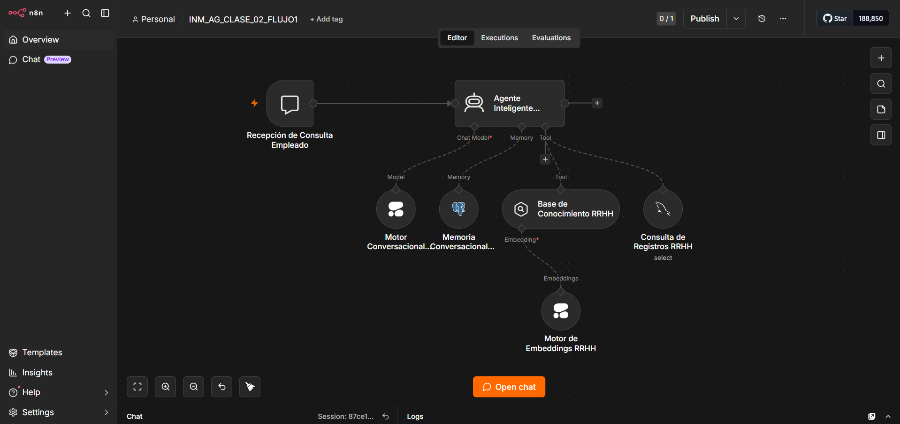

# 🤖 ChocolaTECH HR AI Agent - Clase02

Agente IA híbrido para Recursos Humanos construido mediante automatización con n8n, memoria conversacional persistente, consultas SQL y arquitectura RAG.

---

# 🚀 Descripción del Proyecto

ChocolaTECH HR AI Agent es un sistema conversacional inteligente diseñado para automatizar procesos de RRHH utilizando tecnologías modernas de IA y workflow orchestration.

El proyecto implementa una arquitectura híbrida capaz de combinar:

- 📚 Recuperación semántica (RAG)
- 🗂️ Consultas SQL empresariales
- 🧠 Memoria conversacional persistente
- ⚙️ Automatización mediante n8n
- ☁️ Infraestructura cloud en Railway

El agente interactúa mediante el chat integrado de n8n y puede responder preguntas utilizando tanto información estructurada (SQL) como conocimiento contextual y conversacional.

---

# 🏗️ Arquitectura Híbrida

La solución combina múltiples componentes especializados:

```text
n8n Chat Interface
        ↓
When Chat Message Received
        ↓
Agente Inteligente RRHH
   ├── 🧠 Cohere LLM
   ├── 🗄️ PostgreSQL Memory
   ├── 🗃️ MySQL SQL Retrieval
   └── 📚 Base de Conocimiento RAG
        ↓
Respuesta Conversacional
```

---

# ⚙️ Tecnologías Utilizadas

| Tecnología | Uso |
|---|---|
| ⚙️ n8n | Orquestación y automatización |
| 🧠 Cohere | Modelo conversacional IA |
| 🗄️ PostgreSQL | Memoria conversacional |
| 🗃️ MySQL | Consultas SQL RRHH |
| ☁️ Railway | Infraestructura cloud |
| 🔎 Embeddings | Recuperación semántica |
| 📚 RAG | Knowledge Retrieval |

---

# ✨ Características Principales

- 🤖 Agente IA conversacional
- 🧠 Memoria conversacional persistente
- 📚 Arquitectura RAG
- 🗂️ SQL Retrieval dinámico
- ⚙️ Automatización mediante n8n
- ☁️ Despliegue cloud con Railway
- 🔎 Recuperación inteligente de información
- 🧩 Arquitectura modular y escalable

---

# 📂 Estructura del Proyecto

```text
chocolatech-hr-ai-agent-Clase02/
│
├── README.md
├── .gitignore
├── .env.example
│
├── docs/
│   ├── arquitectura-hibrida.md
│   ├── integracion-mysql.md
│   ├── sql-retrieval.md
│   └── workflow-hibrido.md
│
├── screenshots/
│   ├── hr-ai-agent-workflow.png
│   └── interfaz-chat-n8n.png
│
└── workflows/
    └── hr-ai-agent-workflow.json
```

---

# 📸 Capturas del Proyecto

## 🔄 Workflow Híbrido en n8n



---

# 🧠 Memoria Conversacional

El sistema implementa memoria persistente utilizando PostgreSQL, permitiendo:

- mantener contexto conversacional
- recordar interacciones previas
- mejorar continuidad del diálogo
- personalizar respuestas

---

# 🗂️ SQL Retrieval

La arquitectura incorpora consultas SQL dinámicas mediante MySQL para:

- recuperar registros empresariales
- consultar información RRHH
- integrar datos estructurados
- automatizar consultas internas

---

# 📚 Arquitectura RAG

El agente utiliza recuperación aumentada por generación (RAG) para combinar:

- conocimiento contextual
- embeddings semánticos
- recuperación inteligente
- respuestas enriquecidas mediante IA

---

# ☁️ Infraestructura Cloud

El proyecto utiliza Railway para:
- despliegue de bases de datos
- administración de infraestructura
- conectividad cloud
- servicios persistentes

---

# 🚀 Posibles Mejoras Futuras

- integración con Telegram
- múltiples agentes IA
- dashboards administrativos
- autenticación empresarial
- integración con APIs corporativas
- analytics conversacional
- soporte multiusuario
- bases vectoriales dedicadas
- gestión documental RRHH

---

# 🎯 Objetivo

Demostrar la implementación de un agente IA híbrido moderno utilizando:
- automatización
- memoria conversacional
- SQL Retrieval
- arquitectura RAG
- infraestructura cloud
- integración conversacional empresarial

---

# 👨‍💻 Autor

Proyecto desarrollado como práctica avanzada de automatización, arquitectura híbrida IA y conversational AI utilizando tecnologías modernas de workflow orchestration.